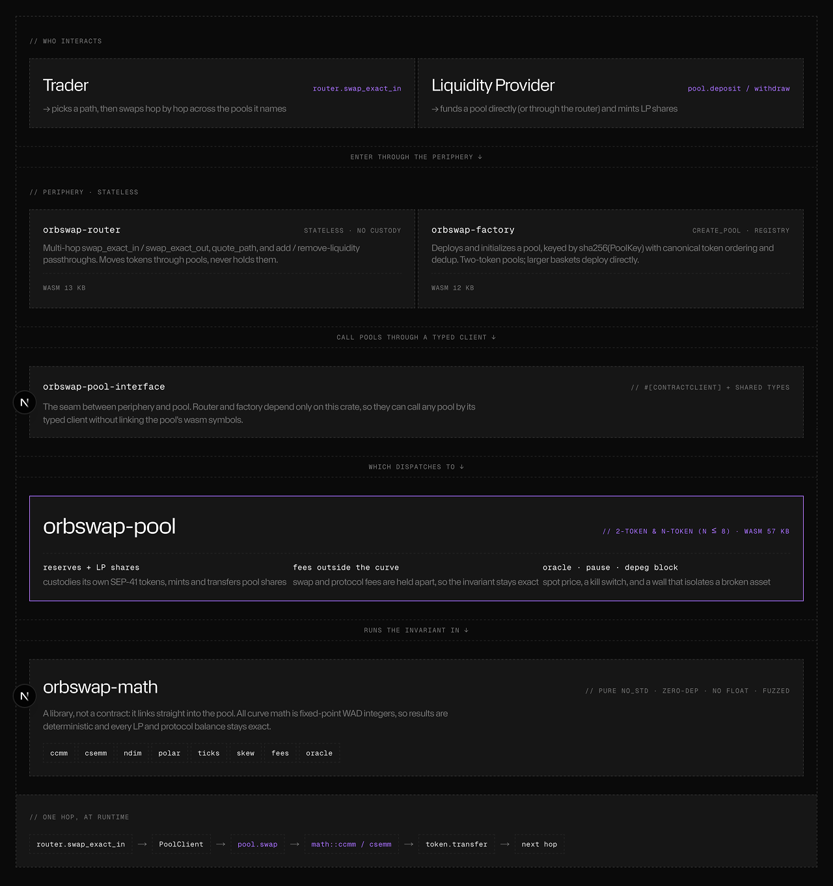

# Orbswap

A concentrated **N-dimensional stableswap** on **Stellar / Soroban**. One pool holds a whole
basket of dollars and prices them on a **polar curve** — a circle (CCMM) or a superellipse
(CSEMM) — instead of constant-product math. The result is deep, capital-efficient liquidity
right at the peg, with a single depegged coin fenced off automatically.

Live on Stellar testnet · pure-Rust Soroban contracts + a Next.js app · 215 tests · clippy-clean · fuzzed

---

## The paper

Orbswap implements
**[*Concentrated N-dimensional AMM with Polar Coordinates in Rust*](frontend/public/orbswap-paper.pdf)**
(Tolstikov, Wentz, Schiarizzi — Sept 2025), porting its six goals to a pure-Rust Soroban stack
(`#![no_std]`, no-float, WAD fixed-point, fuzzed) with fees held **outside** the curve so the
invariant stays exact to the integer:

| # | The paper's goal | In Orbswap |
|---|---|---|
| 1 | The **Orbswap invariant** | [`ccmm`](contracts/orbswap-math/src/ccmm.rs) (circle) + [`csemm`](contracts/orbswap-math/src/csemm.rs) (superellipse) |
| 2 | **Swap in polar coordinates** | [`polar`](contracts/orbswap-math/src/polar.rs) |
| 3 | **Concentrated ticks** in polar coords | [`ticks`](contracts/orbswap-math/src/ticks.rs) + the live Circular pool |
| 4 | **Skew** the ticks with an ellipse | [`skew`](contracts/orbswap-math/src/skew.rs) |
| 5 | **Depeg risk** of n-token pools, mitigated | isolation via allow-flags |
| 6 | **Multimodal** liquidity | [`ndim`](contracts/orbswap-math/src/ndim.rs) / [`fingerprint`](contracts/orbswap-math/src/fingerprint.rs) |

---

## The problem

Stablecoins all target \$1, but AMMs make you pick one trade-off:

- **Curve** holds many stablecoins in one pool, but spreads liquidity flatly across the whole
  curve — most of it parked at prices that never trade.
- **Uniswap v3** concentrates liquidity where it matters, but only for **two** tokens at a time.
- And when a coin breaks peg, a flat stable pool happily **drains into it**, dumping every LP
  into the broken asset.

Orbswap does concentration *and* many assets *and* depeg isolation, in one pool.

---

## The idea — polar coordinates

Write the curve in **polar form**. For two tokens the invariant is a circle centred at the
balanced point $k$:

$$(x - k)^2 + (y - k)^2 = k^2$$

Every point on the arc is a single **angle** $\theta$, with reserves $x = k(1-\cos\theta)$,
$y = k(1-\sin\theta)$. At $\theta = 45°$ the pair trades exactly 1:1 — that's the \$1 peg — and
the curve only bends as the basket drifts off it. A swap is one step along the arc.

For a whole basket the circle generalizes to a **superellipse**. In two dimensions the paper
writes it as

$$\left\lvert \tfrac{x}{\alpha} - 1 \right\rvert^{u(\alpha)} + \left\lvert \tfrac{y}{\beta} - 1 \right\rvert^{u(\beta)} = 1, \qquad u(x) = \frac{\ln 2}{\ln\frac{x}{x-1}}$$

where $\alpha, \beta$ widen the left/right tails. Shrink them toward 2 and the curve approaches a
constant-sum line; widen them toward $\infty$ and it approaches a boxy LMSR. At
**$\alpha = \beta = 2 + \sqrt{2}$ it is exactly the circle above** — the two are one family of
curves. Orbswap runs the symmetric $n$-token version of this ($n \le 8$).

Concentration then comes in two flavours:

- **Circular (CCMM)** — 2 tokens, concentrated with **polar ticks**: each LP places liquidity
  between two angles, Uniswap-v3-style but in *angle space*, so capital packs against the peg.
- **SuperElliptical (CSEMM)** — 2–8 tokens, concentrated by the **curve shape**: slide $u$ from
  a gentle constant-sum line up to a near-boxy LMSR. No ticks to manage.

Either way a single depeg is **contained, not socialized**: a tick position the price leaves
simply stops trading, the superellipse soaks up far less of a drifting coin than a flat pool, and
a confirmed depeg can be **fenced off outright** — so a broken coin can't drain the LPs who
supplied the others.

---

## What we built

A clean Rust/Soroban stack, no EVM, no floats:

- **`orbswap-math`** — a pure `#![no_std]`, zero-dependency, no-float WAD fixed-point library:
  `ccmm`, `csemm`, `ndim`, `polar`, `ticks`, `skew`, `fees`, `oracle`. Fuzzed. This is the whole
  invariant, testable in isolation.
- **`orbswap-pool`** — the pool contract: `deposit` / `withdraw` / `swap` / `swap_exact_out`,
  plus concentrated `add_liquidity` / `remove_liquidity` for tick pools. Fees held outside the
  curve, protocol fee, spot oracle, pause, depeg block. 2-token and N-token (n ≤ 8).
- **`orbswap-factory` / `orbswap-router`** — stamp out pools and route stateless multi-hop
  swaps; the router never custodies tokens.

On top, a **Next.js app** (signed with [Freighter](https://www.freighter.app/)) swaps any pair,
shows both live pools, and adds liquidity with a flow that **adapts to the pool type** — a
balanced multi-token deposit for the SuperElliptical pool, a concentrated angle-range add for the
Circular one — plus positions and recent on-chain events.

Two pool families run live on testnet: a **SuperElliptical** basket (USDC/EURC/USDM/BRLT) seeded
to 24M, and a **Circular** tick pool (USDC/NGNC) with real concentrated positions. USDC bridges
them, so a EURC → NGNC swap routes multi-hop through it.

---

## Built on Soroban

Stellar/Soroban isn't incidental — it's the natural home for this paper:

- **The paper asks for Rust/WASM with fixed-point math; Soroban runs exactly that.** The paper's
  own Note 1 warns that floating point is non-deterministic across hardware. Our contracts are
  `#![no_std]`, no-float, WAD integer math, so the paper's equations *are* the contract — not a
  reimplementation in a weaker VM.
- **One signed transaction, no lock frame.** Soroban's source-account auth lets a single
  signature authorize both the call and its token pulls, so a swap or deposit is one plain tx —
  no approve/permit dance, no unlock/settle callback.
- **SEP-41 tokens, per-pool self-custody.** Each pool is its own contract holding its own
  reserves; there is no shared singleton to trust.
- **Tiny footprint.** Optimized wasm: pool 89 KB, factory 12 KB, router 12 KB — well under
  Soroban's limits.

---

## Architecture

Five crates, wired build-time so the periphery can call any pool without linking its wasm:



- **Self-custody, no singleton.** Each pool is its own Soroban contract that holds its own
  SEP-41 token reserves. The factory just deploys them; the router only moves tokens *through*
  a pool, never holding them.
- **The math is a library, not a contract.** It links straight into the pool, so the invariant
  is deterministic integer math and every LP / protocol balance stays exact.

### The two pool families

One pool contract runs either curve; the mode is fixed at init.

- **Circular (CCMM) — 2 tokens, polar ticks.** Concentration is Uniswap-v3-style but in *angle
  space*: each position is an arc `[lower°, upper°]` with its own liquidity `L` and
  `feeGrowthInside`, tracked by a tick bitmap and crossed as the price walks the circle. The
  first add is full-range `[0,90]` and fixes the price at **45° (the peg)**; later adds pick any
  sub-arc. Positions are per-owner, not fungible.
- **SuperElliptical (CSEMM) — 2–8 tokens, shape concentration.** No ticks: the exponent bakes the
  concentration into the curve. Deposits are **balanced** (first) then **proportional** to the
  current reserves and mint **fungible LP shares**, so one deposit takes even exposure to the
  whole basket.

### How a swap settles

No lock, no callback frame. Soroban authorizes the token pull with the caller's own signature, so
a swap is one plain transaction:

```
trader ─► pool.swap(from, token_in, amount_in, token_out, min_out, deadline)
    from.require_auth()                  one source-account signature also authorizes the pull
    net = amount_in − fee                swap + protocol fee skimmed, held OUTSIDE the curve
    out = math::swap_step(reserves, net) solve the polar curve on virtual reserves (isqrt_wide)
    require out ≥ min_out                slippage guard
    transfer_in(token_in)  ·  transfer_out(token_out)
```

The router just chains this across pools for a multi-hop path; it never holds the tokens.

### How liquidity is added

```
SuperElliptical ─► pool.deposit(from, amounts[], min_shares, deadline)
    first deposit must be balanced on the curve; later ones proportional to reserves
    mint fungible LP shares   (MINIMUM_LIQUIDITY locked on the very first deposit)

Circular ─► pool.add_liquidity(from, [x_max, y_max], lower°, upper°, min_liq, deadline)
    first add is full-range [0,90] → fixes the price at 45° (the peg)
    L = liquidity_for(range, price);  pull only what the arc needs (rounded pool-favoring)
```

### Fees stay outside the curve

Every pool holds one solvency invariant:

```
token balance  ==  reserves  +  ProtocolOwed  +  LpFeesOwed
```

Fees are skimmed *before* the swap touches the curve and parked in separate ledgers, so the
reserves only ever hold what the curve owns and the invariant is exact **to the integer**. The
curve math is fixed-point WAD with a 256-bit `isqrt_wide` (so the ≈`L²` circle radicand can't
overflow an `i128`), and every rounding is pool-favoring — fuzzed to prove no value leaks on a
round-trip trade.

---

## Why it matters

- **No liquidity fragmentation.** One basket pool serves every pair from a single reserve
  vector — a 4-coin pool is 6 markets sharing one book, not six thin pools.
- **Capital efficiency at the peg.** Concentration (ticks or curve shape) makes a dollar near
  \$1 behave like far more reserve, where stablecoins actually trade.
- **N coins, not 2.** Add another dollar to the basket without standing up a new market.
- **Depeg isolation caps tail loss.** The curve absorbs far less of a drifting coin than a flat
  pool, and a confirmed depeg can be hard-fenced (its deposits and buy-side blocked, withdrawals
  left open) so LPs always exit — the tail IL that dumps a flat stable pool into the broken coin
  is capped by construction.
- **Fees stay outside the curve.** Swap and protocol fees are accounted separately, so
  `balance == reserves + owed`, exact to the integer, and fuzzed to prove it.

---

## How it compares

| Property | Uniswap V3 | Curve Stable | Balancer | **Orbswap** |
|---|---|---|---|---|
| Assets per pool | 2 | 2–8 (fixed) | 2–8 (fixed) | **N (2–8)** |
| Concentrated liquidity | Yes | No | No | **Yes** |
| Per-LP price range | n/a | No | No | **Yes (tick pool)** |
| Depeg drains pool | n/a | Yes | Yes | **Isolated** |
| Capital efficiency at peg | High (pair) | ~1–2× flat | ~1–2× flat | **~100× flat** |
| Price oracle | Yes | No | Yes | **Spot** |
| LP position type | NFT (721) | LP token | LP token | **Shares** |
| Venue | Standalone | Standalone | Standalone | **Soroban / Stellar** |

---

## Repo layout

```
orbswap/
├── contracts/     Rust/Soroban workspace — math lib + pool/factory/router, scripts, docs
│                  → see contracts/README.md
└── frontend/      Next.js app — swap, pools, positions, add-liquidity, wired via Freighter
                   → see frontend/README.md
```

---

## Live on Stellar testnet

Network passphrase: `Test SDF Network ; September 2015`. Full records in
[`contracts/deployments/`](contracts/deployments/).

| Contract | Address |
|---|---|
| SuperElliptical pool — USDC/EURC/USDM/BRLT, 24M | [`CDGR7RRE…2RWK`](https://stellar.expert/explorer/testnet/contract/CDGR7RRE72JKAW5UATPKCANAPVX3YVLPDEKSPNPVZ5BKLI43VAUC2RWK) |
| Circular tick pool — USDC/NGNC, 5M | [`CATAWBZM…37HC`](https://stellar.expert/explorer/testnet/contract/CATAWBZMD337WXYZ3R5CX7KNFCBDLI7TAMDU6XSSPRDBLMZXWIGQ37HC) |
| Factory | [`CCKK33NW…5TJW`](https://stellar.expert/explorer/testnet/contract/CCKK33NWDQPSONMRAWH2FNF2ZRZ4VR3PLUP73FUHZGOEMUH665WD5TJW) |
| Router | [`CCARGBIG…AVLJ`](https://stellar.expert/explorer/testnet/contract/CCARGBIGZFOUIOSVM4Q5RNDOIJISYOFSL2VHVYPYWIZP67IV6FHGAVLJ) |

USDC is shared across both pools, so EURC / USDM / BRLT ↔ NGNC route multi-hop through it.
The full token list is in [`contracts/README.md`](contracts/README.md).

---

## Getting started

```bash
# Contracts (Rust 1.91 + wasm32v1-none target, stellar-cli 27+)
cd contracts
cargo test                                              # full suite
cargo build --target wasm32v1-none --release \
  -p orbswap-pool -p orbswap-factory -p orbswap-router
bash scripts/seed_testnet.sh                            # deploy + seed a 4-token pool to 24M

# Frontend (needs the Freighter extension on Testnet)
cd frontend
npm install && npm run dev                              # http://localhost:3000
```

---

## References

- **Orbswap paper** — Vasily Tolstikov, Marcus Wentz, Joseph Schiarizzi, *Concentrated N-dimensional AMM with Polar Coordinates in Rust* (September 2025): [`frontend/public/orbswap-paper.pdf`](frontend/public/orbswap-paper.pdf)
- Paradigm Orbital (prior art): <https://www.paradigm.xyz/2025/06/orbital>
- Curve StableSwap: <https://resources.curve.finance/pdf/stableswap-paper.pdf>
- Soroban: <https://developers.stellar.org/docs/build/smart-contracts/overview>

## License

MIT.
